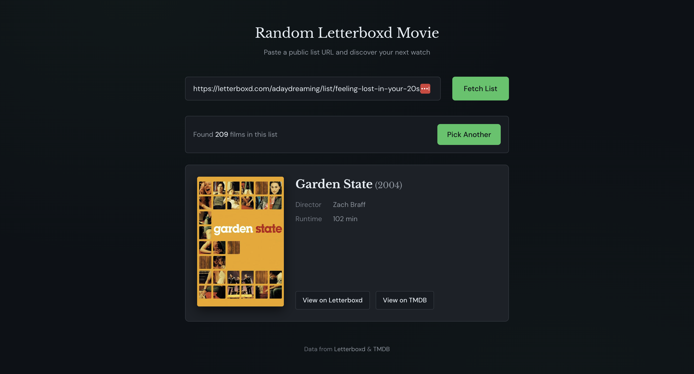

built to solve my indecisiveness when it comes to picking a movie to watch.

1. Clone the repository
2. `npm install`
3. Create a `.env.local` file with your TMDB Read Access Token:
   ```
   TMDB_API_KEY=your_read_access_token_here
   ```
4. `npm run dev`



## Features

- Paste any public Letterboxd list URL
- Supports multi-page lists (up to 50 pages)
- Deduplicates films
- Shows: title, year, runtime, director, and poster
- Fast re-rolls (list is cached client-side)